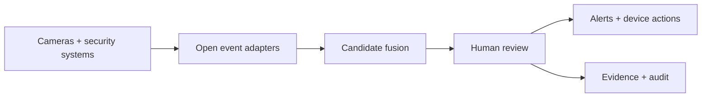
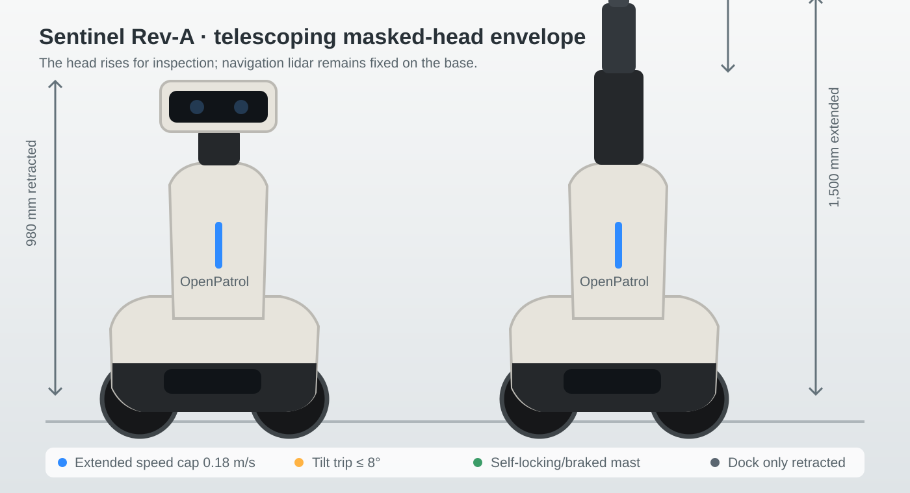
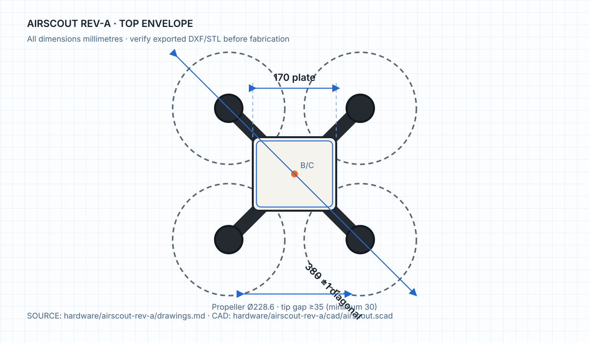

<p align="center"></p>

<h1 align="center">OpenPatrol</h1>
<p align="center"><strong>Open security. Human control.</strong></p>
<p align="center">A local-first command centre that brings cameras, NVR/VMS events, alarm and access systems, fixed sensors, patrol robots and drones into one human-reviewed incident and evidence workflow.</p>

<p align="center">
  <a href="https://eyeinthesky6.github.io/openpatrol/">Project site</a> ·
  <a href="docs/setup-guide.md">Setup</a> ·
  <a href="docs/architecture.md">Architecture</a> ·
  <a href="hardware/README.md">Hardware</a> ·
  <a href="CONTRIBUTING.md">Contribute</a>
</p>

<p align="center">
  
  
  
</p>

> [!IMPORTANT]
> **Completed digital engineering prototype (Rev-A), not field-certified hardware.** The polished hero image is an AI-generated product concept, not a fabrication drawing or field photograph. The software, simulation, firmware interfaces, parametric CAD, BOMs, wiring guidance and engineering specifications are ready for inspection and virtual testing. Every hardware design remains physically unvalidated; fabrication, site calibration, endurance testing and certification are a future physical-validation phase. The CAD and locked drawing schedules are the engineering source of truth.

## Why OpenPatrol

Security estates are usually split across camera software, alarm panels, access systems, sensors and proprietary robot consoles. OpenPatrol provides an inspectable coordination layer without replacing certified safety systems or hiding consequential decisions inside an autonomous black box.

- **Bring your existing systems.** Ingest RTSP/ONVIF-compatible camera paths, Frigate, MQTT, NDJSON and generic authenticated security events.
- **Fuse before alarming.** Retain weak observations, combine corroborating signals and raise reviewable incident candidates.
- **Keep a person accountable.** Operators review, label, announce, talk back, dispatch and preserve evidence with an audit trail.
- **Extend to devices.** Route bounded commands to speakers, strobes, sirens, sensor hubs, ROS ground platforms and an autopilot-owned drone boundary.
- **Inspect the machine.** Hardware sources, safety assumptions, wiring, BOMs and drawing schedules live beside the software.

<p align="center"></p>

<p align="center"><em>AI-generated operating concept showing the intended combined workflow—not field-test evidence.</em></p>

## What is implemented

| Layer | Included |
|---|---|
| Command centre | camera wall, devices, patrol state, incidents, evidence receipts, operator audit |
| Security ingestion | Frigate, MQTT, NDJSON, generic event API, sensor-hub bridge |
| Incident workflow | fall, break-in, drowning/distress, fight, sudden movement, fire/smoke, panic, tamper, loitering and restricted-zone candidates |
| Alerts and response | browser notifications/audio, strobe/siren routes, announcements, recorded operator talkback |
| Robotics | waypoint patrol states, dock return, E-stop simulation, ROS 2 Jazzy/Nav2/Gazebo twin |
| Physical boundaries | serial ground-controller protocol, independent Sentinel mast controller, bounded MAVLink velocity intent |
| Engineering | five Rev-A reference builds, OpenSCAD, BOMs, wiring, firmware and acceptance guidance |

## Quick start

Python 3.11+; the lightweight command-centre demo has no third-party runtime dependency.

```bash
pipx install git+https://github.com/eyeinthesky6/openpatrol.git
openpatrol
```

Open `http://127.0.0.1:8765`. The wheel includes the dashboard and default warehouse scenario. `openpatrol doctor` reports optional integrations without silently installing multi-gigabyte packages.

From a checkout:

```bash
./scripts/openpatrol up        # lightweight command centre
./scripts/openpatrol vision    # Frigate/go2rtc camera path
./scripts/openpatrol security  # MQTT alarm/access/sensor bridge
./scripts/openpatrol full      # camera + security bridge
```

## How signals become action



OpenPatrol creates **incident candidates**, not guaranteed detections. Camera analytics must be calibrated and measured for each site. Certified fire, pool, medical, access-control and other life-safety systems remain independently operational.

## Engineering reference builds

| Platform | Prototype role | Estimated BOM |
|---|---|---:|
| [Rover One Rev A](hardware/rover-one-rev-a/README.md) | robust four-wheel ground patrol | ₹36,891 |
| [TriScout Rev A](hardware/triscout-rev-a/README.md) | lowest-cost smooth-floor rover | ₹32,499 |
| [AirScout Rev A](hardware/airscout-rev-a/README.md) | supervised aerial inspection | ₹44,980 |
| [Sentinel Rev A](hardware/sentinel-rev-a/README.md) | elevated sensing and telepresence, 980–1,500 mm head | ₹66,890 |
| [Security Sensor Hub Rev A](hardware/security-sensor-hub-rev-a/README.md) | 8 wired zones plus speaker/strobe/siren | ₹8,700 |

Prototype sourcing estimates exclude labour, tax, validation and connected third-party equipment.

### Drawing-controlled concepts

| Sentinel Rev-A mast envelope | AirScout Rev-A flight envelope |
|---|---|
| [](hardware/sentinel-rev-a/drawings.md) | [](hardware/airscout-rev-a/drawings.md) |

The hero and warehouse images communicate the product direction. Controlled exterior features and critical dimensions are defined in [`docs/family-design-language.md`](docs/family-design-language.md), the platform OpenSCAD sources and each locked drawing schedule. The source-aligned family line diagram remains available at [`docs/assets/openpatrol-hardware-family-concept.svg`](docs/assets/openpatrol-hardware-family-concept.svg) for technical comparison rather than use as the public hero.

## Validate the repository

```bash
./scripts/check.sh
openpatrol hardware check all
./scripts/openpatrol export-hardware all
```

The CI suite checks command-centre behavior, schemas, integrations, device agents, evidence, safety limits, simulations and hardware profiles. ROS/Gazebo smoke tests remain environment-specific.

## Documentation map

| Start here | Operate and integrate | Build and validate |
|---|---|---|
| [Setup guide](docs/setup-guide.md) | [Operator guide](docs/operator-guide.md) | [Hardware build guide](docs/hardware-build-guide.md) |
| [Architecture](docs/architecture.md) | [Command centre](docs/command-centre.md) | [Hardware platforms](docs/hardware-platforms.md) |
| [Product requirements](docs/product-requirements.md) | [Integration contracts](docs/integrations.md) | [Safety validation](docs/safety-validation.md) |
| [API](docs/api.md) | [AI incident detection](docs/ai-incident-detection.md) | [Virtual hardware](docs/virtual-hardware.md) |

## Safety and scope boundary

- No face recognition, covert monitoring, weapons, pursuit or autonomous physical intervention.
- Ground robots require hardwired drive cuts, watchdogs, measured stopping envelopes and supervised acceptance.
- AirScout requires autopilot-owned arming, geofence, command and battery failsafes plus applicable aviation/site review.
- Browser controls never replace physical safety circuits.
- For LAN use, set separate operator, ingest and device tokens and place HTTP behind an authenticated TLS gateway or VPN. Never expose OpenPatrol, MQTT, Frigate/go2rtc, ROS 2 or MAVLink directly to the internet.

See the [threat model](docs/threat-model.md), [security policy](SECURITY.md) and [safety validation plan](docs/safety-validation.md).

## Contributing

Issues, integration adapters, documentation fixes, simulation scenarios and fabrication feedback are welcome. Read [CONTRIBUTING.md](CONTRIBUTING.md) before opening a pull request. For vulnerabilities, follow [SECURITY.md](SECURITY.md) rather than filing a public issue.

Software is licensed under [Apache-2.0](LICENSE). Original hardware source is intended for CERN-OHL-P-2.0 distribution; see [hardware/LICENSE-NOTICE.md](hardware/LICENSE-NOTICE.md).
