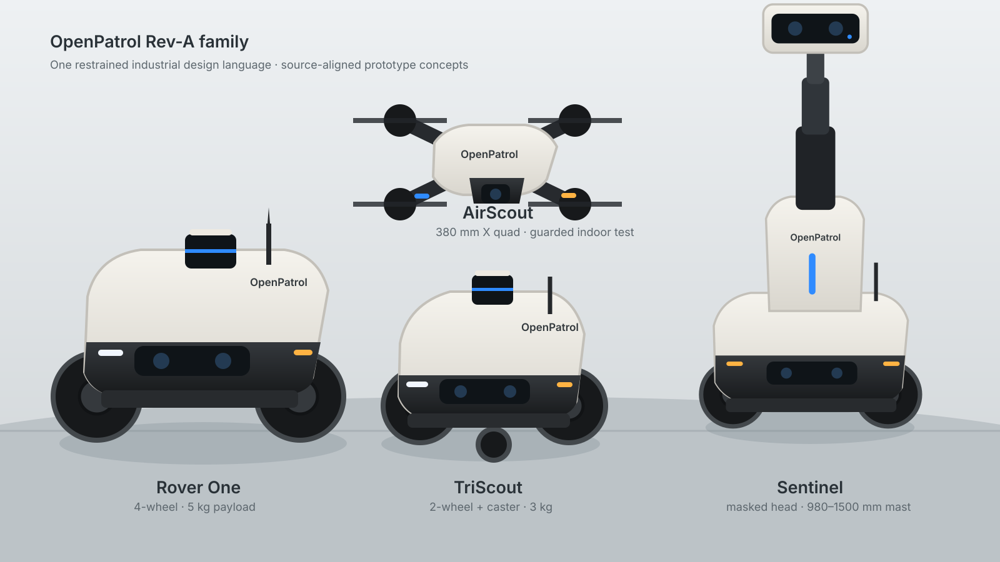

# OpenPatrol

OpenPatrol is a mobility-agnostic, local-first patrol and evidence reference system. It ships a working software simulation—not a mock screen—that closes the loop from route execution and detection through tamper-evident evidence, human review, audit history, safety-state controls and observability.



> **Engineering-source-aligned design render, not built hardware.** Rover One, TriScout, AirScout and Sentinel have inspectable ready-to-test prototype engineering packs. All remain physically unvalidated until fabricated units pass the committed acceptance protocols.

## Install the lightweight core

The core uses Python 3.11+ and no third-party runtime packages:

```bash
pipx install git+https://github.com/eyeinthesky6/openpatrol.git
openpatrol
```

Open `http://127.0.0.1:8765`. The wheel includes the dashboard and default warehouse scenario. Run `openpatrol doctor` to inspect optional capabilities and `openpatrol setup` before installing heavy components.

From a repository checkout, Docker users can run:

```bash
./scripts/openpatrol up
```

The script creates local secrets, builds the non-root image, waits for the health endpoint and only then prints the dashboard URL.

## Optional components

OpenPatrol does **not** silently install multi-gigabyte robotics packages.

- `openpatrol setup --with vision` explains the Docker/Frigate camera path.
- `openpatrol setup --with ros-gazebo` checks ROS 2 Jazzy and Gazebo Harmonic.
- `openpatrol setup --with mavros-air` checks the AirScout MAVROS boundary.
- `openpatrol setup --with openscad` checks hardware-export capability.
- From a checkout, set `CAMERA_RTSP_URL` in `.env` and run `./scripts/openpatrol vision`.

## What works

- configurable waypoint patrol with pause, resume, return-to-dock and E-stop simulation states
- synthetic detections and authenticated external detection ingestion
- atomic evidence receipts with immutable capture and append-only review history
- responsive local operator UI, incident filters and review dispositions
- versioned JSON API, health endpoint, Prometheus-compatible metrics and security headers
- provider-neutral vision adapter and pinned optional Frigate/Mosquitto profile
- ROS 2 Jazzy ground safety adapter, SLAM Toolbox/Nav2 configuration and Gazebo Harmonic warehouse twin
- physical serial boundary for Rover One, TriScout and Sentinel drive controllers
- independent Sentinel mast protocol, bridge and reference RP2040 firmware
- bounded AirScout velocity-intent adapter behind an ArduPilot/PX4-owned flight controller
- deterministic acceptance models for AirScout geofence/command loss and Sentinel mast/speed interlocks
- four cost-controlled hardware engineering packs with CAD, BOM, wiring and compatibility profiles

Run verification with:

```bash
./scripts/check.sh
openpatrol hardware check all
```

## Hardware reference builds

| Platform | Architecture | Prototype role | Engineering BOM |
|---|---|---|---:|
| Rover One Rev A | four-wheel skid steer | robust primary ground reference | ₹36,891 |
| TriScout Rev A | two-wheel differential + caster | lowest-cost smooth-floor reference | ₹32,499 |
| AirScout Rev A | guard-ready X quadcopter | supervised aerial inspection | ₹44,980 |
| Sentinel Rev A | four-wheel base + telescoping masked head | elevated sensing and telepresence | ₹66,890 |

Sentinel's sensor head retracts to about 980 mm and extends to 1,500 mm. The mast is separately controlled, self-locking/braked, hard-limited and tilt-interlocked; ground speed is capped at 0.18 m/s when raised. AirScout keeps attitude, arming, motor mixing, geofence and failsafes inside ArduPilot/PX4—OpenPatrol supplies only bounded velocity intent.

Export every fabrication pack with:

```bash
./scripts/openpatrol export-hardware all
```

See `docs/family-design-language.md`, `docs/hardware-platforms.md`, `docs/hardware-build-guide.md` and `hardware/`.


The visuals communicate the exterior design embodied by the family CAD. They are not field-test photographs. The checked-in Gazebo validation remains focused on the Rover One ground path; AirScout and Sentinel have deterministic contract tests and physical integration source but still require fabricated-unit validation.

## Configuration

| Variable | Default | Purpose |
|---|---|---|
| `OPENPATROL_HOST` | `127.0.0.1` | Bind address; container sets `0.0.0.0` |
| `OPENPATROL_PORT` | `8765` | HTTP port |
| `OPENPATROL_DATA` | `./runtime` | Persistent local evidence directory |
| `OPENPATROL_SCENARIO` | bundled warehouse | Simulation scenario |
| `OPENPATROL_TICK_SECONDS` | `0.4` | Simulation tick interval |
| `OPENPATROL_INGEST_TOKEN` | unset | Bearer token enabling detection ingestion |
| `OPENPATROL_OPERATOR_TOKEN` | unset | Bearer token protecting commands and review |
| `OPENPATROL_SIGNING_KEY` | unset | HMAC-SHA256 receipt-origin key |
| `OPENPATROL_RETENTION_DAYS` | `30` | Maximum evidence age |
| `OPENPATROL_MAX_RECORDS` | `5000` | Hard receipt cap |

For LAN use, set both tokens and put HTTP behind an authenticated TLS gateway or VPN. Do not expose OpenPatrol, ROS 2, MAVLink/MAVROS, MQTT, Frigate or go2rtc directly to the internet.

## Safety and project boundaries

The browser E-stop is a product-state demonstration. Physical ground robots require hardwired power interruption, controller-level watchdogs, charging interlocks and measured stopping envelopes independent of Linux, Wi-Fi and the browser. AirScout requires autopilot-owned arming and failsafes plus applicable site and aviation review. OpenPatrol excludes weapons, pursuit, deliberate contact, face recognition and covert monitoring.

“Ready-to-test prototype” means the source is sufficiently specified for competent fabrication and supervised bring-up. It does not mean commercially certified, production proven or safe for unsupervised public deployment.

Software is Apache-2.0. Original hardware source is intended for CERN-OHL-P-2.0 distribution. Documentation and concept media must retain their stated licences and provenance.
